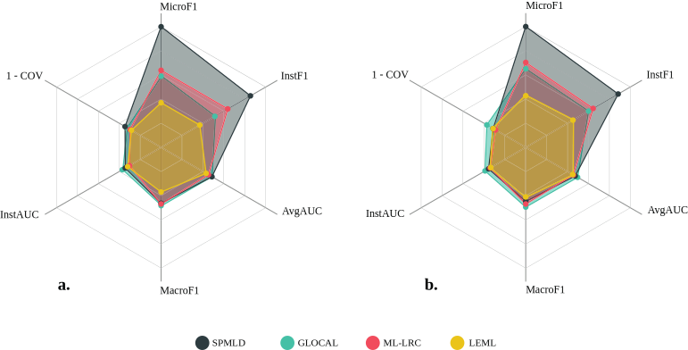

# SPMLD

  ## Self-Paced Multi-Label Learning with Diversity
  
  *Seyed Amjad Seyedi, S. Siamak Ghodsi, Fardin Akhlaghian, Mahdi Jalili, Parham Moradi *
  
  *Asian Conference on Machine Learning, PMLR 101:790-805, 2019*
  
  *http://proceedings.mlr.press/v101/seyedi19a.html*
  

  # Abstract

 The major challenge of learning from multi-label data has arisen from the overwhelming size of label space which makes this problem NP-hard. This problem can be alleviated by gradually involving easy to hard tags into the learning process. Besides, the utilization of a diversity maintenance approach avoids overfitting on a subset of easy labels. In this paper, we propose a self-paced multi-label learning with diversity (SPMLD) which aims to cover diverse labels with respect to its learning pace. In addition, the proposed framework is applied to an efficient correlation-based multi-label method. The non-convex objective function is optimized by an extension of the block coordinate descent algorithm. Empirical evaluations on real-world datasets with different dimensions of features and labels imply the effectiveness of the proposed predictive model. 

